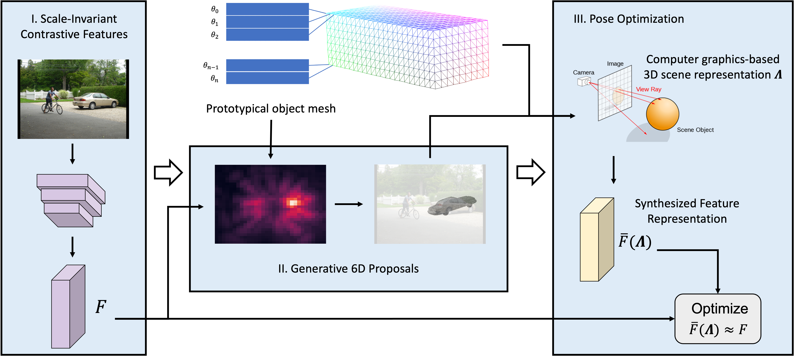

# Robust Category-Level 6D Pose Estimation with Coarse-to-Fine Rendering of Neural Features

PyTorch implementation for robust category-level 6D pose estimation with coarse-to-fine rendering of neural features.

  

**Robust Category-Level 6D Pose Estimation with Coarse-to-Fine Rendering of Neural Features**
 
[Wufei Ma](https://wufeim.github.io),
[Angtian Wang](https://github.com/Angtian),
[Alan Yuille](https://www.cs.jhu.edu/~ayuille/),
[Adam Kortylewski](https://adamkortylewski.com/)
 
In European Conference on Computer Vision (ECCV) 2022
 
[[Paper]]()

## Installation

- Python 3
- [PyTorch](https://pytorch.org)
- [PyTorch3D](https://github.com/facebookresearch/pytorch3d/blob/main/INSTALL.md)

## Preparation

## Training and Evaluation

## Pretrained Model Weights
